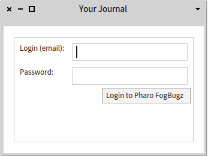
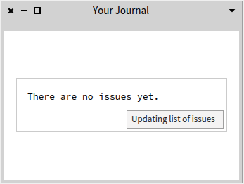
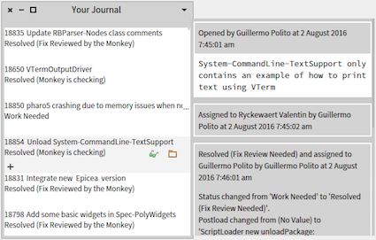

# GT-Collaborate [](https://travis-ci.org/JurajKubelka/GT-Collaborate)

Set of tools that permits collaboration in Pharo. 

## Description

Right now, it integrates [Pharo FogBugz issue tracker](http://pharo.fogbugz.com). You can open the application in [Pharo](http://pharo.org) (World menu / Collaboration / Your Journal), login to FogBugz, and see opened cases (issues) with details.


Login window:



Updating window (if there are no loaded issues):



Main window:



## Installation

It is under development. You can install development version in [Pharo 6](http://pharo.org). 

```
Metacello new
	baseline: #GTCollaborate;
	repository: 'github://JurajKubelka/GT-Collaborate/repository';
	load.
```
